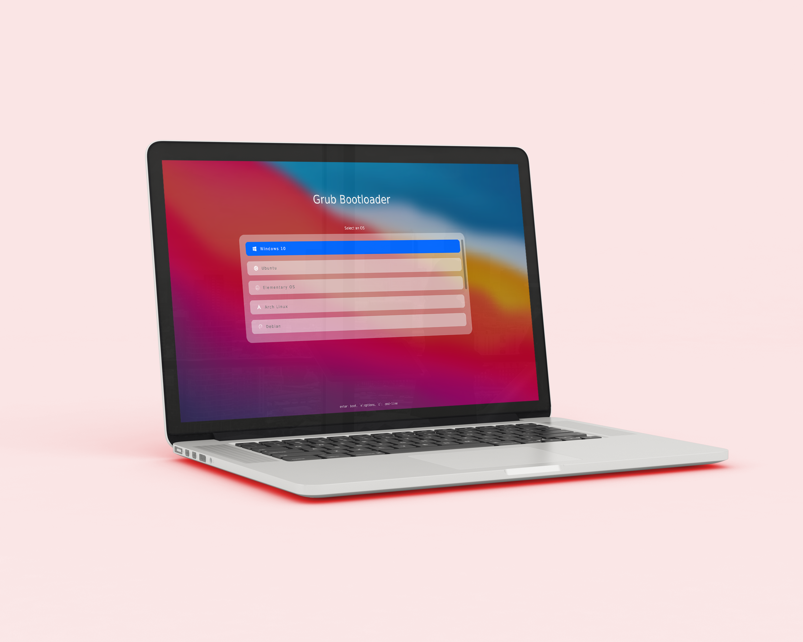

<h1 align="center">
  BigSur
</h1>

<p align="center">
    A Grub2 Bootloader Theme
</p>

<div align="center">





</div>


## Usage:

##### Grub2:

```bash
$ git clone https://github.com/Teraskull/bigsur-grub2-theme

$ cd bigsur-grub2-theme

$ ./install.sh
```
##### Ventoy:

* Copy the `ventoy` folder to the exFAT partition on your Ventoy USB drive, as explained [here](https://github.com/ventoy/Ventoy/issues/110).


## License:

This software is available under the following licenses:

  * **MIT**
